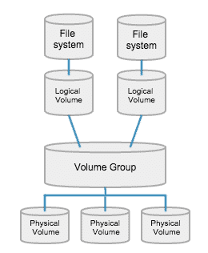

# Linux LVM - Linux Logical Volume Manager

Logical volume manager (LVM) introduces an extra layer between the physical disks and the file system allowing file systems to :  
– be resized and moved easily and online without requiring a system-wide outage.  
– Use discontinuous space on disk  
– have meaningful names to volumes, rather than the usual cryptic device names.  
– span multiple physical disks

## Components of LVM:

### Physical Volume (PV)-
Physical Volume can be a disk partition, the whole disk, a meta-device, or a loopback file, e.g. `/dev/sda`, `/dev/sdb` and so on.   Here we can basically tell LVM that we're going to use this particular partition for LVM. 
Using the command `pvcreate` storage can be initialized for use by LVM.

### Volume Group (VG)-
This is nothing but an arbitrary container for PVs and LVs. It sits on top of PVs.
The command `vgcreate` creates a new volume group.

### Logical Volume (LV)-
A Logical Volume is the conceptual equivalent of a disk partition in a non-LVM system. For example, we can have an LV for  `/`, `/var`, `/home`, etc. We can create more than one logical volume for multiple purposes. An LV can be grown or shrunken as per our convenience provided that there is unclaimed space present in the volume group.

Using the command `lvcreate` , a new logical volume can be created from an existing volume group.

### File System -
Every time we create an LV, we need to format it with a file system, e.g. Ext4.
The command `mkfs` can be used to create file system on top of a logical volume. Once the file system is created we can mount the logical volume as per our need.

#### Misc:
 - Use `df -h` to view the amount of disk space available in all the mounted drives.
 - Use `lsblk` to list information about all available block devices.
 - Use `pvdisplay`, `vgsisplay`, `lvdisplay` to list information about all available configured PVs, VGs, and LVs.
 - We can view the `fstab` file to list information regarding the Linux file system table on the machine.

