# Working with Linux LVM

Reference: https://www.youtube.com/watch?v=MeltFN-bXrQ
## 1. Creating Physical Volumes

Before adding our volumes to a volume group, we need to inform LVM that we intend to use the volume with it. For this we need to make our volume into a new Physical volume (PV). Using the command `pvcreate` storage can be initialized for use by LVM. 
This is our drive status before pvcreate:
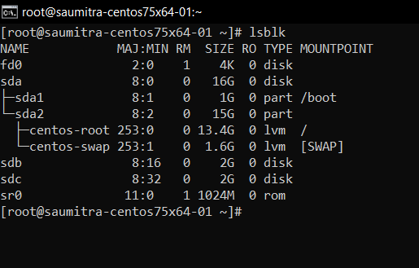

We intend to use the `dev/sdb` drive and create a PV from it. This is our result:

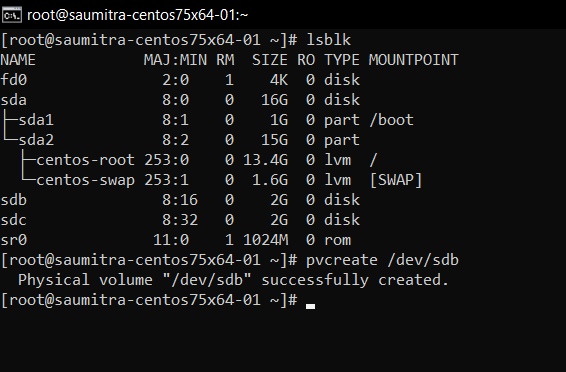

We can view the status of our PVs with the help of `pvdisplay` command.

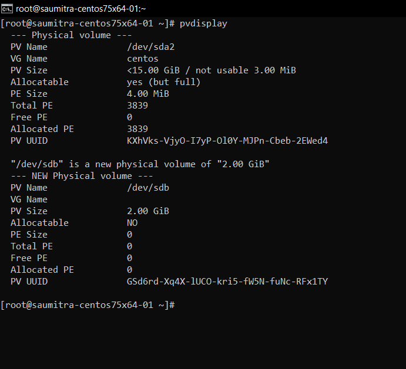

## 2. Extending Volume Groups

Since our machine already has a VG `centos` available, we can add our newly created PV to this VG. This can be done using the `vgextend` command.

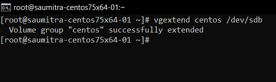

Because we have extended the existing VG, the `vgdisplay` command shows the following output.

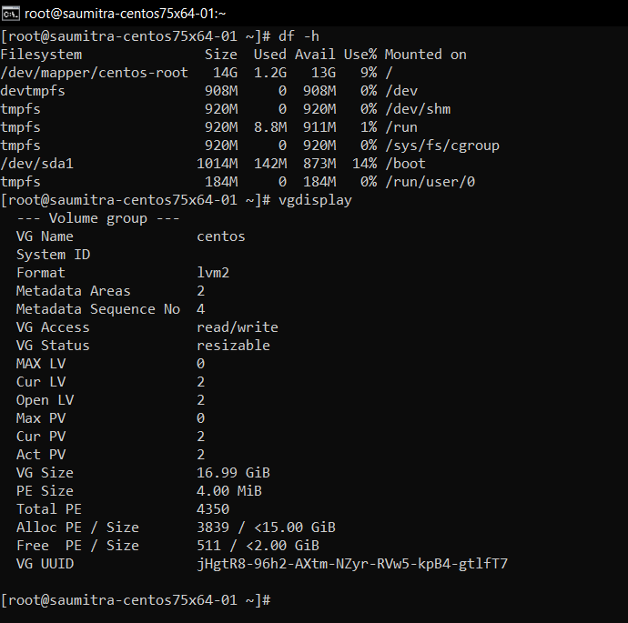

However, our mounted drive summary (using `df -h`) still does not show the drive.

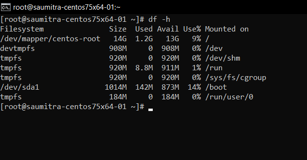

This is because we haven't yet created a logical volume from the volume group. It is necessare to either create a new LV or extend an existing LV for them to be recognised in the `df -h` command.

Thus, we currently have:

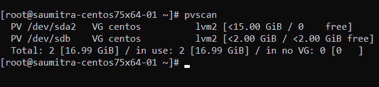

## 3. Logical Volumes

### A. Extending existing LVs-

We can use a part of the 2GB free space from our VG and allocate it to existing LVs. Let us extend the `/dev/mapper/centos-root` by 512 MB.

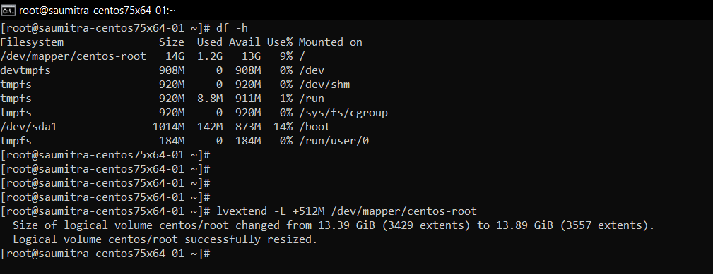

However, the `centos-root` volume still doesn't show any change in its size.

This is because, we also need to tell the filesystem to occupy all the remaining free space available in the `centos-root` LV. The filesystem present in the root directory is `xfs`. Thus, we perform the extension with the help of `xfs_growfs /dev/centos/root` command.

This grows our LV size as follows:

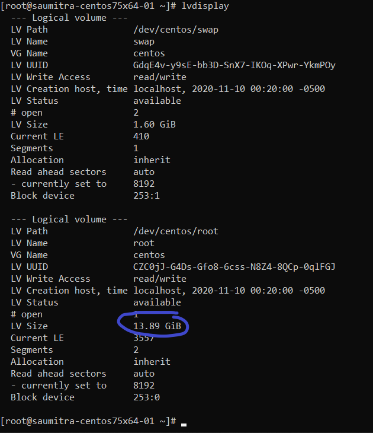

### Creating new LVs-

With the remaining 1.5GB of free space in our VG, we can create a new LV. This is done with the help of the `lvcreate` command.

`lvcreate VG_Name -l space_to_be_allocated -n name_of_LV`

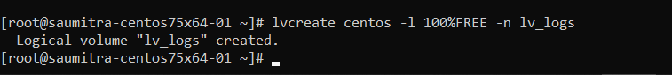

Similar to the previous step, here too we need to initialize a filesystem to the newly created LV. As is the trend, we use `xfs`.

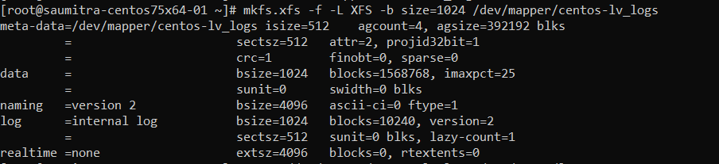

Now that we have a filesystem created, we need to mount this newly created LV. For that we need to create a mount point, and then mount the LV on it. 

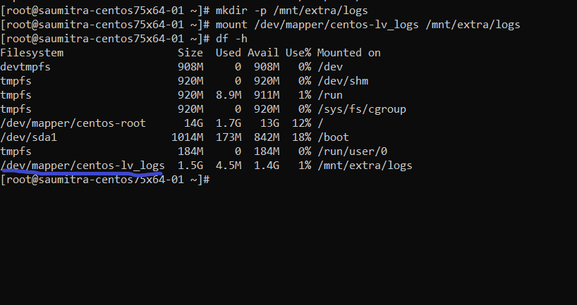

## 4. Editing `fstab`

While we indeed have successfully mounted our newly created LV, it will not be mounted automatically the next time our server restarts. This is because our OS has no record of this new LV in its file system table (`fstab`). In order to make our system automatically mount our LV, we need to edit the `fstab` file in our system.

First, we need to refer to our LV block using a UUID. This can be obtained using the `lsblk` command.

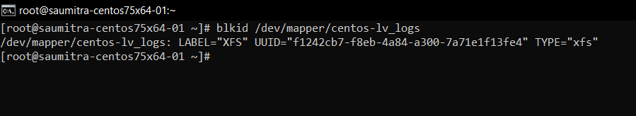

We create a backup of our `fstab` file in case something goes wrong. And we unmount our LV in order to test it later.

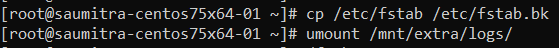

Then, we edit the `fstab` file. We mention our LV with its UUID, we mention the mount point, the default flags and the priority. The number 2 indicates that this LV is given a low priority when mounting.(As the root LVs are more important and must be given a high priority).

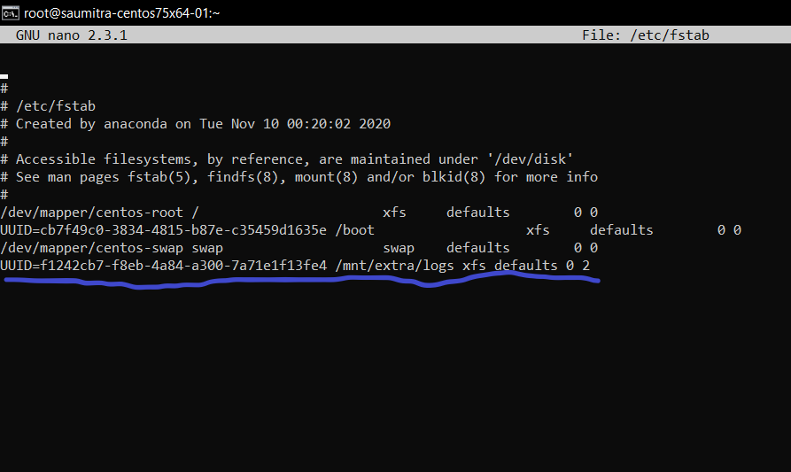

In order to check if our `fstab` edit has worked, we try the `mount -a` command. This command tells linux to mount all the drives mentioned in its `fstab` file.

The `df -h` command is used to check the status of the mounted drives. 

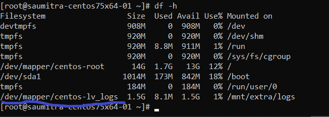

## 5. Snapshots

LVM also allows us to take snapshots of our LVs in case we make a change that breaks some files, and a need arises to roll back to the previous status of the files.

In order to create a snapshot, we again have to use the `lvcreate` command, but with some options. Creating a snapshot requires us to have unclaimed space.

`lvcreate path_to_LV -L size -s -n name_of_snapshot`

In order to view all the existing snapshots, we use the `lvs` command. A default snapshot is created the moment we create a new LV. All the snapshots that we manually create are also displayed here. Their origin parameter tells us the difference.

Similar to LVs, we can also mount snapshots to a mount point. this is how we can recover the last system state.

In order to recover data from the snapshot to the original directory from where the snapshot was taken, we use the following command:

`lvconvert --merge path_to_snapshot `

This rolls back the origin volume of the snapshot to the state the snapshot was in.
In order to refresh the LVs so that our change can be seen, we need to deactivate the LV and then reactivate it. This is done by the follwing 2 commands:

`lvchange -an path_to_LV`
`lvchange -ay path_to_LV`

Now we remount the drive in order to see the changes.