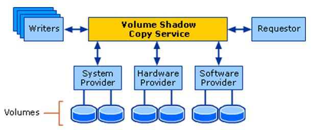
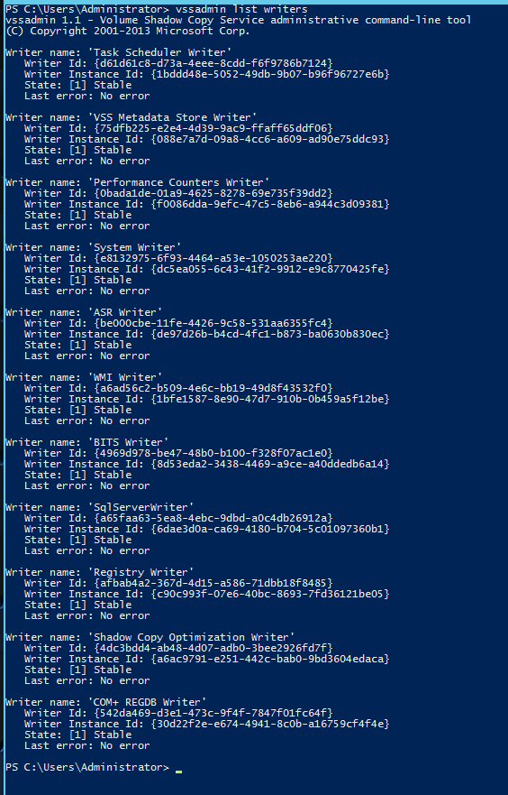
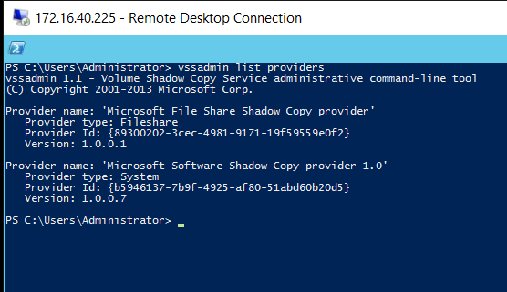
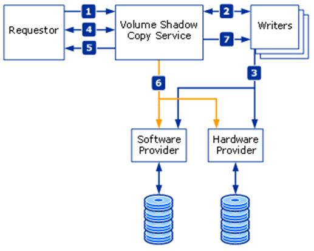

# Microsoft Windows Volume Shadow Copy Service (VSS)

References:
1.  https://docs.microsoft.com/en-us/windows/win32/vss/volume-shadow-copy-service-portal
2.  https://docs.microsoft.com/en-us/windows-server/administration/windows-commands/vssadmin
3.  https://docs.microsoft.com/en-us/windows-server/storage/file-server/volume-shadow-copy-service
4.  https://www.youtube.com/watch?v=tvl1pk7BojM

# Overview

The VSS service in Windows enables users to have a backup (shadow) volume of a particular drive. This enables users to roll back to a previous state on the drive if a need arises to do so.

It implements a framework to allow volume backups to be performed while applications on a system continue to write to the volumes. It was first introduced in Windows XP.

When we first set up a drive for VSS, it reserves (pre-allocates) a fixed space (area) on the drive for it to carry out its operations called `Shadow Storage`. By default it reserves 4GB of space. We need at least **300 MB** of space for our `Shadow Storage`. Theoretically, we can use 50% of our drive space for actual data, while the other 50% are reserved for the `Shadow Storage`.

As users overwrite data blocks in a drive, the previous data blocks are stored in the `Shadow Storage`. Thus, the old data which we replace, is technically not "replaced". It is copied into the `Shadow Storage`. As a result, the `Shadow Storage` continues to grow as we keep making changes to a drive.

## When to take backup?

Whenever we are continuously updating (or overwriting) files on a drive with VSS enabled, Windows is also taking a backup of the older file in its `Shadow Storage`. But how does it know *when* to take a backup? Because, if a backup is taken in the middle of a write, and then the server goes down, the backed up data is corrupted (as it was incomplete),and thus your data is lost permanently.

There is a solution. Windows has a component called `KTM (Kernel Transaction Manager)` which monitors disk activity. Whenever the disk is in an idle state, it begins to take a backup in the `Shadow Storage`.

But there can also be various different applications running together on the OS (eg. SQL server, Micosoft Exchange, etc.) which may be simultaneously overwriting data on the same VSS enabled drive. Thus, even if *one* application is writing, there will still be disk activity present and a backup will not be taken.
For this reason, Windows also has another component called a `VSS Writer`.

`VSS Writers` are application specific (e.g. SQL Writer, Exchange Writer). They are custom writers provided by the of the vendor application. If an application *does not* have its own `VSS Writer`, there is a chance that the backed up file might end up corrupted.

### Note: 
The `vssadmin` command is used to initate all VSS related operations.

# Components

## VSS Writers

`VSS writers` tell Shadow Copy when it can start backup. They essentially trigger the backup process.  In order to view the existing vss writers in the system, we use the command `vssadmin list writers`.

## VSS Requesters and Providers

Every VSS request has to come from somewhere. It is the `vss requester` that initiates the request for VSS. It could be a click in the UI, a backup application which starts the request, or even a system activity.Basically, it is any application that uses the VSS API to request VSS services to create and manage shadow copies of one or more volumes.

The `vss requester` triggers the `vss provider`. This `vss provider` tells Windows where to go and start a backup. We can view a list of providers using: `vssadmin list providers`.

A VSS provider can be hardware or software. A hardware provider comes from the manufacturer of the storage device (eg. HP 3PAR), and comes with its own set of rules. It has the ability to override the software rules, and can generate an entirely separate volume to store storage snapshots.

# How a backup is taken

## Prepare for backup

1. The `requester` asks the VSS service to go through all the `writers` iteratively, gather the writer metadata, and prepare for shadow copy creation.

2. Each `writer` creates an XML description of all the components that need to be backed up and provides it to the VSS Service. The VSS Service provides the writer's description to the `requester`, which selects the components that will be backed up.

3. The VSS Service notifies all the `writers` to prepare their data for making a shadow copy.

4. Each `writer` prepares the data as required, like completing all open transactions, rolling transaction logs, and flushing caches. When the data is ready to be shadow-copied, the `writer` notifies the VSS Service.

5. The VSS Service tells the `writers` to temporarily freeze application write I/O requests (read I/O requests are still possible) for the few seconds. This activity has a timeout of 60 seconds. The VSS Service flushes the file system buffers and then freezes the file system, which ensures that the file system metadata is recorded correctly and the data to be shadow-copied is written in a consistent order.

## Create the Shadow Copy

6. The VSS Service tells the `provider` to create the shadow copy. The shadow copy creation period lasts no more than 10 seconds, during which all write I/O requests to the file system remain frozen.

7. The VSS Service releases file system write I/O requests.

8. VSS tells the `writers` to resume application write I/O requests.

## End Backup and Resume Activity

9. If the shadow copy is successfully created, the VSS Service returns the location information for the shadow copy to the `requester`.

10. In some cases, the shadow copy can be temporarily made available as a read-write volume so that VSS and one or more applications can alter the contents of the shadow copy before the shadow copy is finished. After VSS and the applications make their alterations, the shadow copy is made read-only. This phase is called `Auto-recovery`, and it is used to undo any file-system or application transactions on the shadow copy volume that were not completed before the shadow copy was created.
