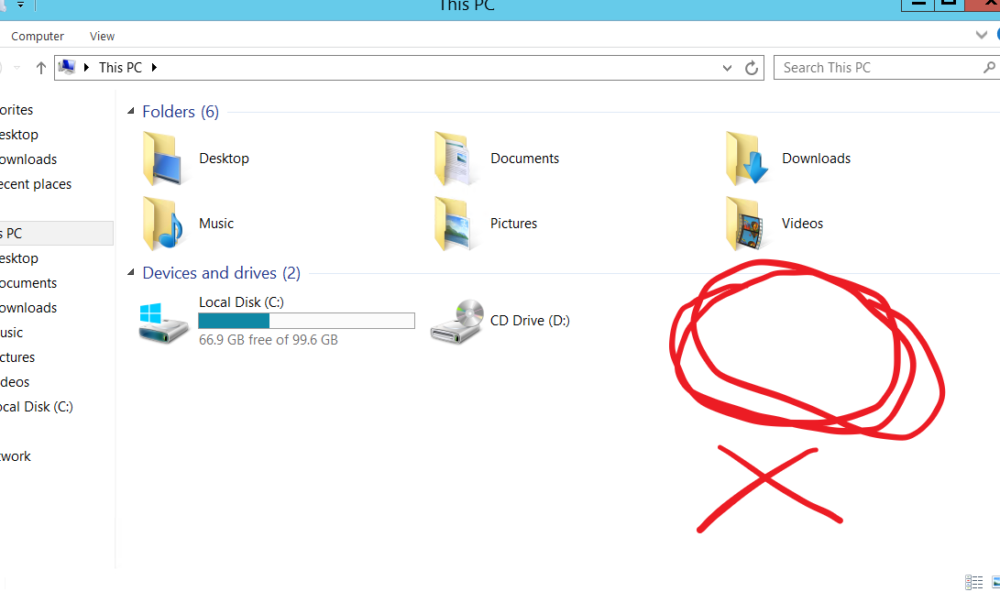

# Performing VSS

Before we actually create a shadow copy of a drive and back up data to it, we must add a file to our drive in order to verify whether the restore has worked or not.

So we create a file in our drive and fill it with text in order to verify.

## Creating a VSS Shadow Copy -- The wrong way :(

Here we basically tell VSS that we want to add our drive to the VSS service. That is, we intend to backup the changes to this drive. In order to do so, we write the command `diskshadow`. The diskshadow interface helps us to create and manage shadow copies on the system.
We then tell `diskshadow` to add our volume to the VSS service. This is done using:  `add volume volume_path`.

Then, we create the shadow copy (ie the reserved space for backups) using the `create` command.

Let's see the results:

In order to expose the shadow copy to the filesystem as a new drive, we need to refer to the Shadow Copy using its ID.
But, if we do try this ...

Looks like we cannot explore our newly created shadow file. This is because we did not specify that we want to create a persistent shadow copy. A non-persistent shadow copy is not browsable and will eventually be deleted from the drive after the termination of the backup operation.

## Creating a VSS Shadow Copy -- The correct way :)

Here we follow all the same previous steps. The only difference here is that we explicitly specify that we do want a persistent shadow copy. This is done by using the command: `set context persistent`.

 Such type of a shadow copy will *persist* on the disk even after we exit `diskshadow`.

 ## Making changes

 Let us delete the `Donotdelete.txt` file that we created at the beginning. If we are able to recover this file later using the shadow copy, then we shall say that we have successfully saved a snapshot of the volume in its previous step.

 

 Also, deleting the file from the recycle bin to ensure that it permanently deleted.

  

 ## Exposing Shadow Copies to the file system

Now, lets expose the Shadow Copy that we created to the filesystem. We do this by first entering the `diskshadow` interface. We then list all shadow copies that are present on the system using `list shadows all`.

Then, we refer to our Shadow Copy using its ID, and then use the `expose` command by specifying a new drive letter.

`expose shadow_copy_id new_drive_letter`

We can now see that our system has a new drive `Z:/` mounted. It is the exact snapshot of our `C:/` drive before we made changes.

Going into the drive `Z:/`, we can see that our deleted file is indeed present.

Thus, we can see that we have successfully restored our original file with the help of Windows Volume Shadow Copy Service.

## How it works
VSS works on the concept of differential backups. This means that whatever files remain unchanged are taken from the original drive. Only the originals of the changed files (*the differences*) are backed up in the Shadow Copy space.

This means that whatever we are seeing in drive `Z:/` is partly coming from `C:/` drive (the original unchanged files), and partly from the Shadow Copy Volume (*the changes*).

## Cleaning Up

After we copy all the files we want to restore back into `C:/`, we can delete the shadow copy, as it is of no use to us now.For that we need to unexpose our drive `Z:`. First we enter the `diskshadow` interface. Then we list all available shadow copies available.

`list shadows all`

Then, we unexpose the shadow copy we want to by referring to it using its ID.

`unexpose shadow_copy_id`

This will make the drive `Z:/` disappear from the file explorer menu.

Finally, we delete the shadow copy by referring to it using its ID.

`delete shadows id shadow_copy_id`

Thus, all shadow copies we created are deleted.

