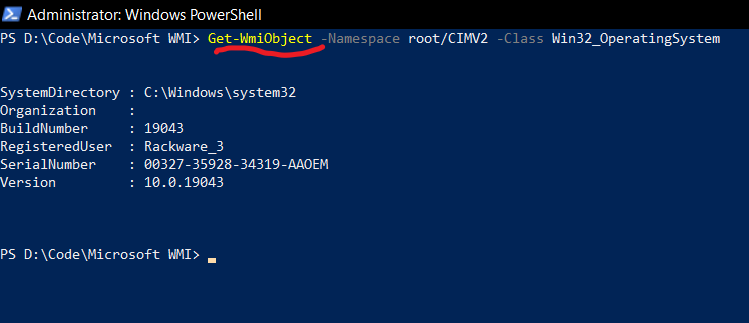
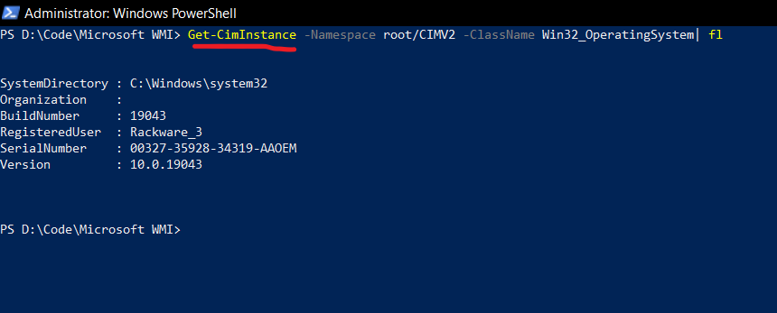

# Windows Management Instrumentation (WMI)

Windows Management Instrumentation (`WMI`) is a subsystem of Windows Powershell that gives administrators access to powerful system monitoring tools. It is basically a management interface that can access data in great detail about a computer.

It is built upon the Common Information Model (`CIM`), which is an open-source standard for accessing and displaying information about a computer. It is an industry standard that’s been around for many years, but it has no method included to access data on a remote computer. WMI is Microsoft’s version of `CIM`. 

WMI is therefore Microsoft’s solution for how to use `CIM` on remote computers over a network. 

## WMI VS CIM - What's the difference?

It is a fact that both `CIM` as well as `WMI` commands are supported by Windows Powershell. Let's see an example:

WMI

CIM

It’s easy to see that WMI and CIM access the same set of data. When accessing local data, WMI and CIM are nearly identical except for minor cosmetic differences in the output. So, what gives?

 The difference comes when accessing data from a remote pc. Both approaches are different at the network level. For a WMI connection to succeed, the remote computer must permit incoming network traffic on TCP ports 135, 445, and additional dynamically assigned ports between 1024 to 1034.These many number of ports needed to make a successful connection make security pros nervous about using WMI on a corporate network.

 In 2012, Microsoft addressed these concerns by releasing a new version of WMI called Windows Remote Management (WinRM). It needs only two ports to make a secure connection. It uses ports 5985 and 5986 and those ports connect via HTTP and HTTPS. All traffic is encrypted by default even when using an insecure protocol like HTTP. 

 New cmdlets were created in PowerShell v3.0 to take advantage of WinRM. These new cmdlets are called “CIM-based” cmdlets, meaning they work with the `CIM` standard. `CIM` is in the name of almost all the cmdlets. 
 
 WMI is indeed being deprecated in favour of CIM, and therefore we should prefer using the `Get-CimInstance` command instead of `Get-WmiObject`.

### References - 
1. https://blog.ipswitch.com/get-ciminstance-vs-get-wmiobject-whats-the-difference
2. https://www.youtube.com/watch?v=_NadlLhLldY
3. https://docs.microsoft.com/en-us/windows/win32/wmisdk/wmi-start-page
4. https://github.com/johnthebrit/PowerShellMC 