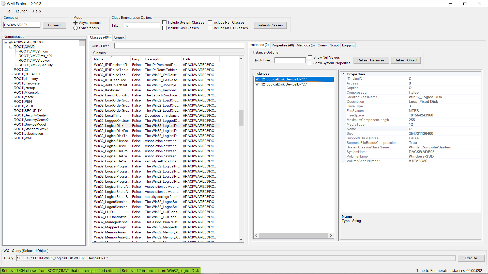
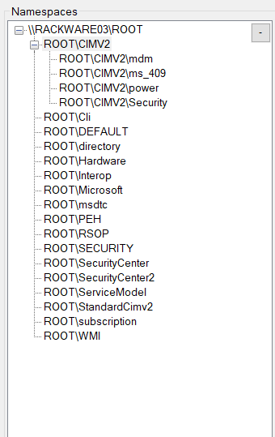
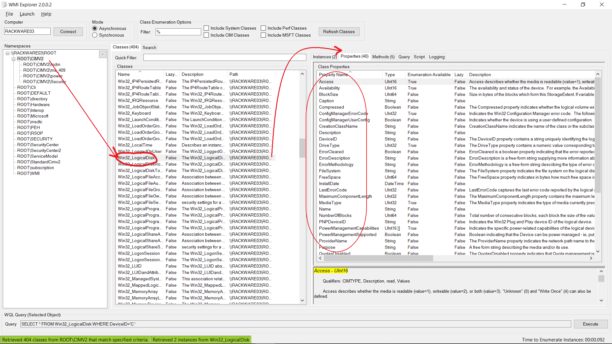
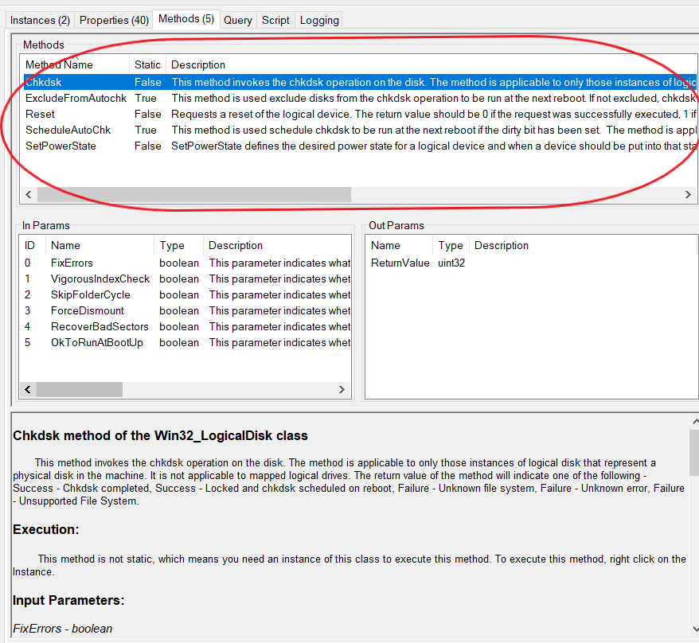
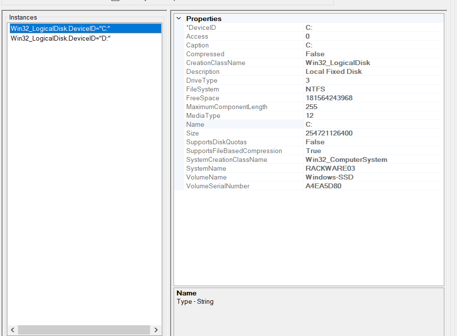

# WMI Structure

The entire WMI repository is organised into Namespaces, Classes and Instances. Each namespace contains classes which are themselves organized in a hierarchy and may contain child namespaces.

We can use the [WMI Explorer](https://github.com/vinaypamnani/wmie2/releases) to explore all the WMI namespaces, classes and instances of a particular system.

## Namespaces
A namespace is a logical grouping of classes which belong to the same management environment. To find useful information, you need to know a Class Name *plus* the Namespace where it lives.

A Namespace organizes information similar to folders in a filesystem. The top “folder” of the WMI namespace is always called `root`.

The `Get-CimInstance` command cannot search recursively through all namespaces. It always searches only one namespace, and if you don’t specify one, it uses the default namespace `root/cimv2`.

## Classes
A WMI class is used as the recipe to create an instance of a WMI object. We can look at a WMI class just like we look at classes in the Object Oriented Programming paradigm. Similar to an OOP class, the WMI class also defines properties and methods. 

For example let's look at the default namespace `root/cimv2`. In it, we look at the class called `Win32_LogicalDisk`. This class has a large number of properties (eg. Size, Free Space, FileSystem,etc. ). These properties are the attributes that any instance of `Win32_LogicalDisk` should have.

Along with this, this class also specifies certain methods (functions) that it can perform. For example, the `Win32_LogicalDisk` class has the methods `Chkdsk`, `ExcludeFromAutochk`, `Reset`, `SchedultAutochk`, `SetPowerState`.

## Instances
An instance is an implementation of a WMI class. For example, we have the class `Win32_LogicalDisk`. The implementation of this class are the actual logical disks that we have in our system (i.e C:/, D:/, E:/, etc. drives). 

It is not necessary that every WMI class should have an instance in the system. For example, the class `Win32_Battery` class will not have an instance in a desktop. Similarly the `Win32_CDROMDrive` will not have any instance in a laptop without a CD drive installed.

