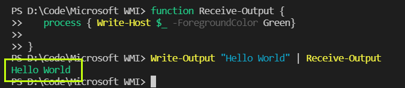
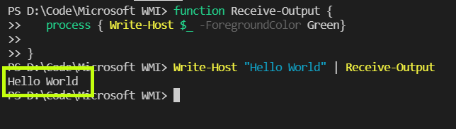
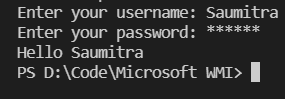
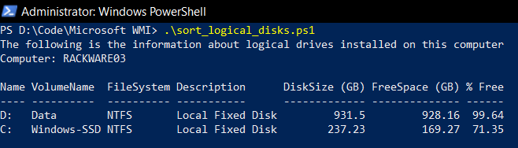
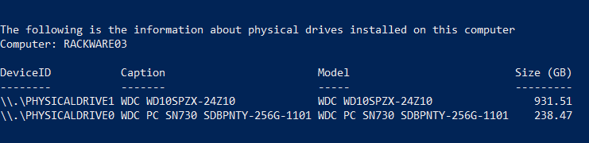

# Powershell Script to Sort Disks

A powershell script is simply a list of commands that Windows powershell executes one after the other. It is built on the built on the .NET Common Language Runtime (CLR). The PowerShell commands are called `cmdlets`. These `cmdlets` let us manage our computers from the command line. 

# Basic Commands
Before we begin writing the powershell script to sort our logical disks, we need to get ourselves acquainted with the basic input/output commands. Refer to [this](hello_world.ps1) program for the code.

```
Note: A powershell script is saved with the .ps1 extension
```
## Outputting to the screen-

In order to display stuff onto the screen, we can use the `Write-Output` or the `Write-host` commands.\

```
Write-Output "Hello World"
```
OR:
```
Write-Host "Hello World"
```

However, there is a key difference between these commands. The `Write-Output` command actually passes the input through the Powershell Objectflow Engine. However, `Write-Host` outputs data directly to the host (the screen) and not along the pipeline.

But what does it mean for us?

Passing an input through the Powershell pipeline allows us to connect various `cmdlets` together. This means that we can pass the output of one command to the input of another (through the pipe `|` operator). Since this is not done for the `Write-Host` command, we cannot pipe together different `cmdlets` using it.

For example, consider the code snippet which defines a function which writes whatever it receives in green colour:
```
function Receive-Output {
   process { Write-Host $_ -ForegroundColor Green}
    
}
```
Now,if we execute the above function, and then pipe the output of `Write-Output` to the above function, we have this command:

```
Write-Output "Hello World"|Receive-Output
``` 
The output looks like:


But, if we try to do the same with `Write-Host`...
```
Write-Output "Hello World"|Receive-Output
```


We can see that there is no change in the output. This simply shows that our input never went through the pipeline. Thus, remember to use `write-output` whenever we want to pass anything to another `cmdlet`. So then what is `Write-Host` used for?

It is simply used to display text to the user in a slightly pretty manner. It consists of certain functions which enable us to alter the text properties. Consider this code snippet:

```
Write-Host "You are looking " -NoNewline
Write-Host "AWESOME" -ForegroundColor Red -BackgroundColor Yellow -NoNewline
Write-Host "today"
```

The output looks like:


## Taking User Input
 In order to take user input, we use the `Read-Input` command. We could also make the user input unreadable using the `-AssecureString` parameter to `Read-Input`. The read input can be stored in variables. The variable names are preceded by the `$` symbol.
 
 Consider the following code snippet:
 ```
$uname = Read-Host "Enter your username"
$pass  = Read-Host "Enter your password" -AsSecureString
Write-Output "Hello $uname"
```
The output looks like:



# Sorting Disks

## Logical Disks

In order to look through the disks in our system, we need to take the help of WMI namespaces and classes. For logical disks, we need to enter the `CIMV2` Namespace and the `Win32_LogicalDisk` Class. The `CIM` command to fetch the all the instances of `Win32_LogicalDisk` class is:

```
Get-CimInstance -Namespace root/CIMV2 -ClassName Win32_LogicalDisk
```
Now that we have our instance at its output, we need to filter some of its properties to get what we want. For this, we need to pipe (`|`) the output though certain `cmdlets`: 

1. `Where-Object`: 
   
   This shall select only those instances which satisfy a certain condition. Lets say that we don't want to display the CD-drives in our system. Thus, we only need to select the instances whose `DriveType` attribute is not equal to 5 (which corresponds to compact disks - [refer here](https://docs.microsoft.com/en-us/windows/win32/cimwin32prov/win32-logicaldisk) )

   Thus, we pipe this snippet to our output:
   ```
   Where-Object {$_.DriveType -ne 5}
   ```
2. `Sort-Object`:
   
   We need to sort our disks in descending order of free space. Thus, we specify the `FreeSpace` property to the `Sort-Object` `cmdlet`.
   Thus, we pipe this snippet to our output:
   ```
   Sort-Object -Descending -Property FreeSpace
   ```
3. `Select-Object`:
   
   We need to display only certain properties of the instance, and not all. Thus, we specify only those properties that we need (Name, VolumeName, FileSystem, Description, Size,FreeSpace, PercentageFree). 
   
   In order to properly format the  Size,FreeSpace,and PercentageFree properties, we define hash tables using the `splat` operator -`@`.

   ```
    $dsize = @{label = "DiskSize (GB)"; expression = {"{0:N}" -f ($_.Size/1GB) -as [float]}}
    ```
    ```
    $fspace = @{label = "FreeSpace (GB)"; expression = {"{0:N}" -f ($_.FreeSpace/1GB) -as [float]}}
    ```
    ```
    $percfree =  @{label = "% Free"; expression = {"{0:N}" -f ($_.FreeSpace/$_.Size * 100) -as [float]}}
     ```
    Thus, we pipe this snippet to our output:
    ```
    Select-Object Name, VolumeName, FileSystem, Description, $dsize,$fspace, $percfree
    ```
4. `Format-Table`:

    Finally, we specify that we want to view the output in a table. We use the attribute `-AutoSize` so that it fits properly.
    Thus, we pipe this snippet to our output:
    ```
    Format-Table -AutoSize 
    ```

Our final command looks like:
```
 Get-CimInstance -Namespace root/CIMV2 -ClassName Win32_LogicalDisk |`
    Where-Object {$_.DriveType -ne 5} |`
    Sort-Object -Descending -Property FreeSpace | `
    Select-Object Name, VolumeName, FileSystem, Description, $dsize,$fspace, $percfree | `
    Format-Table -AutoSize   
 ```

 Output: 

 
## Physical Disks

In a similar manner, we can write the powershell command to display details regarding the physical disks of our system. We to enter need the `CIMV2` Namespace, and the `Win32_DiskDrive` Class in order to display the disk drive instances.

Our code snippet looks like:
```
$physize = @{label = "Size (GB)"; expression = {"{0:N}" -f ($_.Size/1GB) -as [float]}}
```
And:
```
Get-CimInstance -Namespace root/CIMV2 -ClassName Win32_DiskDrive |`
    Sort-Object -Descending -Property Size |`
    Select-Object DeviceID, Caption, Model, $physize | `
    Format-Table -AutoSize 
```

The output:




## References
1. https://www.youtube.com/watch?v=ApbdhcZBcyU&list=PLlVtbbG169nFq_hR7FcMYg32xsSAObuq8&index=5
2. https://stackoverflow.com/questions/363884/what-does-the-symbol-do-in-powershell
3. https://docs.microsoft.com/en-us/windows/win32/cimwin32prov/win32-logicaldisk
4. https://docs.microsoft.com/en-us/powershell/module/microsoft.powershell.utility/sort-object?view=powershell-7.1
5. https://docs.microsoft.com/en-us/powershell/module/microsoft.powershell.utility/select-object?view=powershell-7.1
6. https://social.technet.microsoft.com/wiki/contents/articles/7855.powershell-using-the-f-format-operator.aspx
7. https://stackoverflow.com/questions/34332253/how-can-i-pass-a-comma-seperated-list-of-values-within-powershell-as-a-parameter