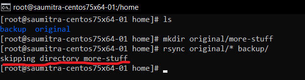
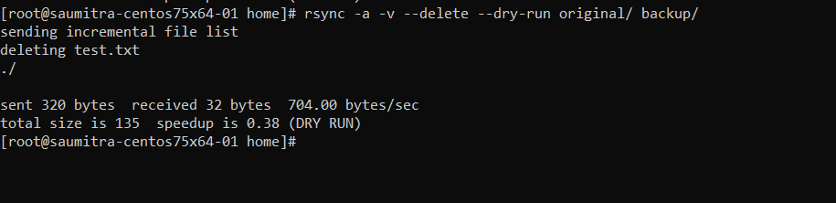

# Syncing Files with Rsync

The `rsync` command in linux allows us to sync files both locally as well as remotely across different directories and remote machines.

# Why `rsync`?

The important thing to understand here is that `rsync` only copies (synchronises) what's different (somewhat like git). This means that every time something is updated in a directory at a particular location, only the *changed* portions since the last backup will get synced, instead of again copying the entire directory.

Another scenario would be when you lose your network connection in the middle of taking a backup. Even in this case `rsync` will know where it left off, and continue from there.

# Lets Begin

We start our exploration of `rsync` by first creating 2 directories on our local machine called `original` and `backup`.

We add some important files to our `original` directory. 


These are the files that we wish to keep a backup of. Let's see what these files contain -


Our backup folder is still empty. We can check it using the `ls` command.


In order to backup the contents of the `original` directory to the `backup` folder, we simply run the `rsync` command, specifying the source and destination directories.

```
rsync source_path dest_path
```


Its done! We can check our backup directory to see that the files have been copied!
Notice that we had to add a star `*` while specifying the source directory. This is because, by default `rsync` does not copy files *recursively*. This means that now if we add a new folder to `original`, `rsync` will simply ignore it.



## Recursive backups (`-r`  and `-a`)
In order to explicitly tell `rsync` that we want to backup all files and folders in the source directory in a *recursive* manner, we use the `-r` (recursive) option.


An analogous option is `-a` (archive). This also copies all the SYMLINKS and timestamps, and is generally the more preferred option.

## Dry Run (`--dry-run`)

Consider a scenario when you are ready to back up gigabytes of data. But after performing the backup, you realise that this was not the destination you wanted to back up to!

Well, you just wasted a lot of time, bandwidth and effort in doing the wrong thing!

As a precautionary measure, we can verify what files we want to copy to the destination using the `dry-run` option. This makes rsync output the same exact things that it would have done while copying the files, but it will not actually copy those files...


So, we get a small glimpse into the future, before we actually execute the backup process. To backup files, we simply remove the `--dry-run` option, and the command works normally.


## Only Differences

As stated earlier, `rsync` only copies the files that are changed in the original directory. It will not re-copy everything. So, if we delete some files in the `original` directory, `rsync` has the ability to detect that.


However, the reverse is not true. If we add a file to the `backup` directory, rsync will not add it to the `original` directory.


## Delete (`-delete`)

If we want our `backup` directory to mirror the `original` directory, we can add the `-delete` option during `rsync`. This option will delete all the files in the `backup` directory that are not there in the `original` directory.



```
CAUTION-
The delete option comes with a very dangerous weapon. If we ever make a mistake of executing the rsync command with the -delete option with an empty source directory, it (as expected) clear the contents of the backup directory too. Many a tale have been told of titams falling to their knees regretting using the -delete option with rsync. This is the reason we must always --dry-run before execution.
```
## Remote File Transfer

`rsync` as a tool really shines here. It gives us the ability to back-up data between remote machines. The syntax of doing so is very similar to that of `ssh`.
The `-z` option allows us to compress files before sending. The `-P` option shows the transfer progress during the operation.

```
rsync -z -a -P source_path user@ip_address:dest_path
```


We can check that we got the files on our remote machine - 


# References - 
1. https://www.youtube.com/watch?v=qE77MbDnljA
2. https://www.youtube.com/watch?v=2PnAohLS-Q4
3. https://stackoverflow.com/questions/818255/in-the-shell-what-does-21-mean
4. https://serverfault.com/questions/835104/what-does-connecttimeout-in-ssh-config-mean
5. https://www.perturb.org/display/1208_SSH_Batch_mode_for_SSH_SCP_scripting.html 
6. https://stackoverflow.com/questions/7411052/bash-while-loop-iterates-only-once-whenever-body-contains-ssh