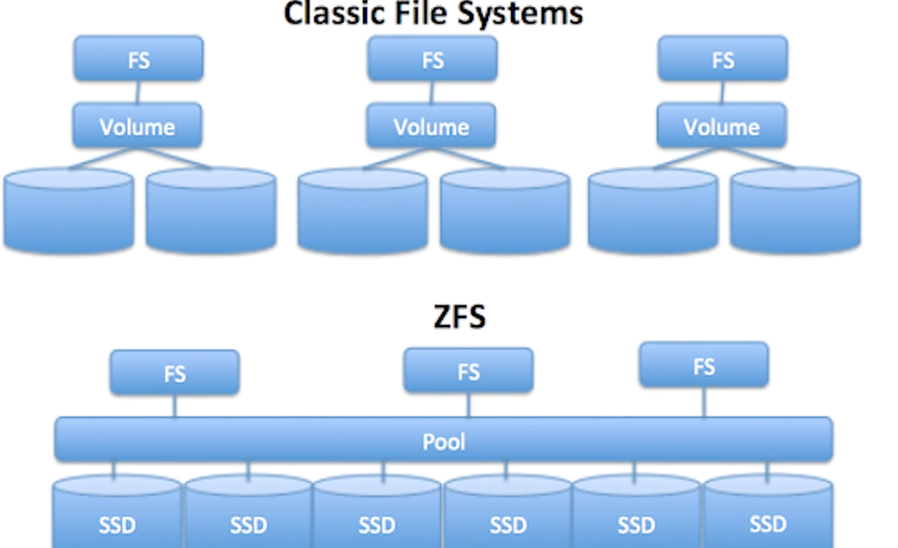
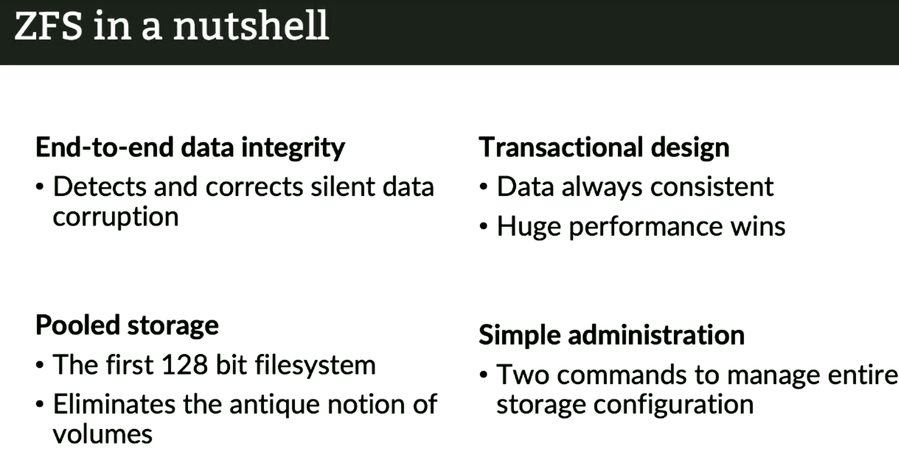

# ZFS -  In a nutshell
ZFS (the "Z" File System) was designed and developed by Sun Microsystems, and then eventually made open-source during their final years, before they were taken over by Oracle.

## Why ZFS? :)

### a. **Hard Drives fail frequently :(**
ZFS is designed to have impeccable *file integrity*, and is able to achieve it using basically commodity hardware. ZFS was explicitly created with the assumption that "mechanical hard drives are unreliable, and are eventually going to fail". ZFS does not trust *anything* to operate correctly, especially hard drives.

Usually when we speak of volume management, we usually introduce a filesystem *after* we create a logical volume. This means that most file systems are only aware of the current volume that they are introduced in. 

ZFS, on the other hand, is *aware* that you probably have multiple physical disks installed. In fact, it was designed with multiple storage devices in mind. This underlying knowledge of how the disks in your storage pool are arranged, helps ZFS to exploit the fact that one of these disk devices may become corrupted.

This is usually what disks in a RAID arrangement do. For example, in a RAID-6 arrangement (consider 4 physical disks), if data in one of the disks is corrupted, we can piece it together with the data and checksum values stored in the remaining 3 disks.

This facility is integrated with the filesystem itself when we use ZFS. So, if we have, say, 4 hard drives in our system, and we want to write data to them. ZFS stripes the data and stores them in such a way all 4 drives are kept busy while at the same time minimising I/O operations to store the checksum information.

ZFS can also handling redundancy like RAID 1. The difference here is that, unlike RAID 1, ZFS also stores checksum information with its mirrors, in order to identify which drive failed.

### b. **Hard Drives haven't improved much**
The pace at which processors have improved is mind-boggling! If we compare a processor from 10 years ago to a present-day one, we can see *exponential* improvements in clock-speeds and performance.

On the other hand, a 100GB mechanical hard drive from a decade ago operated at around 100MB/s speed of data transfer. A 8TB NAS HDD today transfers data at 200MB/s.

This means that while there has been an explosion of progress in CPU design, mechanical hard drives have lagged behind significantly. For a modern day computer, this means that for a significant portion of time, the processor waiting in idle for the hard drive to do stuff.

ZFS takes advantage of this fact. It says "why don'we use this idle period to perform checksum computations?"
So, we have a lot of time to do computations while we're looking for information.

## The Cons  :(
While ZFS is a filesystem, a volume manager and device manager, all rolled into one, it also brings some downsides with it.

For ZFS to perform its drive recovery magic, we cannot add just a single disk to the storage pool. ZFS works best with at least 2 disks involved. If we have a single disk, then ZFS can *at most* tell us that the data on that disk is corrupt somehow, and we might not be able to get it back...

# References-
1. https://www.youtube.com/watch?v=lsFDp-W1Ks0
2. https://openzfs.github.io/openzfs-docs/Getting%20Started/RHEL%20and%20CentOS.html
3. https://docs.fedoraproject.org/en-US/quick-docs/creating-a-disk-partition-in-linux/