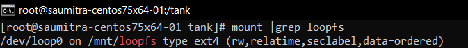
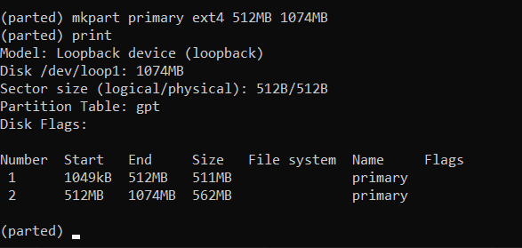

# Working with ZFS

We are tasked with creating a ZFS volume. For that we shall use a blank physical disk `/dev/sdc` with no file system on it. We have made 2 partitions of this disk (`/dev/sdc1` and `/dev/sdc2`).

.

## Creating a Storage Pool

Using ZFS is entirely encompassed in just 2 commands - `zpool` and `zfs`. These two commands manage the entire storage configuration.

We start off by creating a storage pool using the `zpool` command. ZFS can use disks directly, there is no need to create partitions or volumes (unlike LVM). Let's create a storage pool called "tank" from the disks `dev/sdc1` and `/dev/sdc2`. We can query the status of the storage pools using the `zpool status` command.

After creating a storage pool, ZFS will automatically:
* Create a filesystem with the same name (i.e. tank)
* Mount the filesystem under that name (e.g. /tank)

 
 Thus, storage is immediately available to us. We are ready to read and write files to it. Its that simple!

## Creating a sparse file

A sparse file is a file that has large amounts of space preallocated to it, without occupying that entire space from the filesystem.

For example, lets say that we want to reserve 1GB of space for future use. Now, theoretically we could actually store 1GB worth of empty bytes into that file. Yes, our space is now reserved. But at what cost? 

Storing empty bytes is just not efficient. We do know there are many of these bytes in the file, so why store them on the storage device?

We could instead store metadata describing those zeros.When a process reads the file those zero byte blocks get generated dynamically as opposed to being stored on physical storage.

Thus, our "zero" data is generated *as and when a process reads the file*. Such files are therefore called "Sparse Files". 
  
In order to create a sparse file, we use the `dd` command. The `dd` command is used to copy bytes of data from one file to another. We use its `seek` option in order to seek to the amount of space we want (say 1 GB).

In order to check that this file indeed is a sparse file, we can look into the `ls -hl` command.

Another way is to check the `du -h` command with its `apparent-size` option.

## Creating a Loop Device from the Sparse file

Linux supports a special block device called the loop device, which maps a normal file onto a virtual block device. This allows for the file to be used as a “virtual file system” inside another file. With Linux it’s possible to create a file-system inside a single file. 

In order to create a loop device with the sparse file, we use the command `losetup` to create a loop device “loop0”. 

Here,
* `-f` implies that linux finds the first unused loop device. If a file argument is present, use this device. Otherwise, print its name.
* `-P` – force kernel to scan partition table on newly created loop device.

To print the loop device generated, we use `losetup -a`.

## Creating a filesystem on the loop device

Now lets create a ext4 filesystem on the loopback device. We do this using the command:
`mkfs.ext4 /tank/sparse_file.img `

The output looks like: 

## Mounting the Loopback Device

We can now mount the loopback filesystem onto a directory. This is done using the `mount` command. The `-o loop` additional option is used to mount loopback filesystems.

We can verify the size of the new mount point and type of filesystem using `df -hP /loopfs/` command.

We can also verify that the drive indeed has been mounted using the `mount` command and piping it through the `grep loopfs` command to filter the results.

## Partitioning the Mount

In order to partition the mount, we use the `parted` tool in linux. We first specify the volume we wish to partition. Then we make a partition table (generally `gpt`) on the volume.

Let's create 2 partitions of 512 MBs each. This is done using the `mkpart` command:

Partition 1:

Partition 2:

We can see that these partitions are mounted using the `lsblk` command.

# References
1. https://youtu.be/Hjpqa_kjCOI
2. https://www.thegeekdiary.com/how-to-create-virtual-block-device-loop-device-filesystem-in-linux/
3. https://phoenixnap.com/kb/linux-create-partition